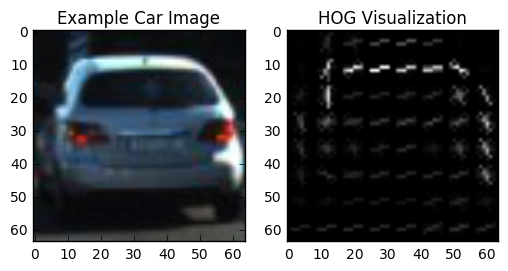
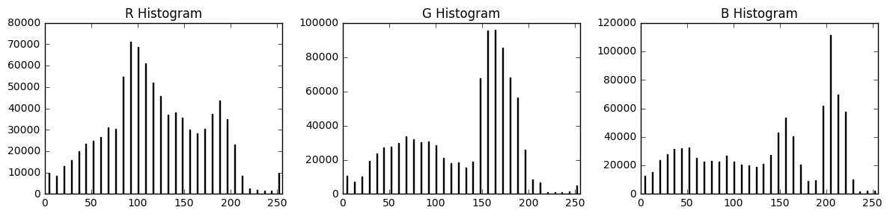
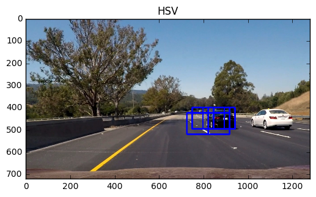
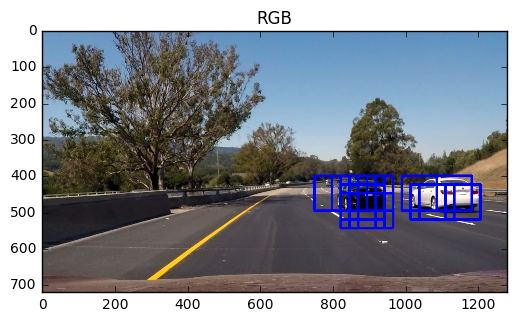
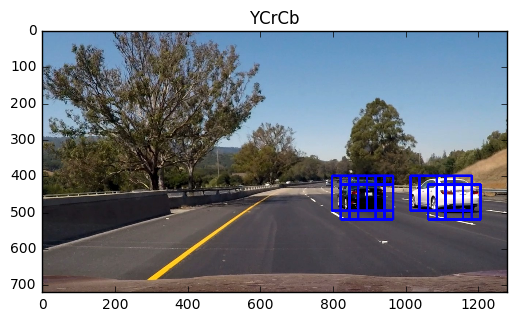
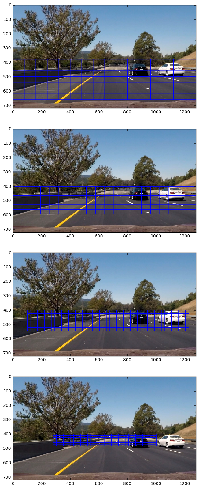

# CarND Term1/P5 - Vehicle Detection
[](http://www.udacity.com/drive)

### Summary

In this project, I implemented a software pipeline to detect vehicles on a video. Project consisted of following steps:

* Loading the training data set (images of cars and not-cars)
* Extracting feature vectors from the data set
* Training a classifier with the training data
* Implementing sliding windows search over regions of a image
* Building heatmaps from the detections
* Extracting bounding boxes (that represent cars) out of the heatmap
* And finally doing the detection for every frame over a video file


The code for review is in `carnd-p5-vehicle-tracking.ipynb` notebook. There is another notebook `vehicle-tracking-playground.ipynb` which is more or less experimental, and not part of the submit.

## 1 Feature Vectors and Classifier Training

Different features of an image determine how an image or a clip will be classified. In this work, histogram of oriented gradients, spatial color binning and color histograms were used as image features.

### 1.1 Histogram of Oriented Gradients (HOG) 

Histogram of oriented gradients (HOG) feature is based on orientation of gradients on an image. Gradient orientations over a cell of pixel is summed up and the dominant orientation represent the cell. HOG is a good for presenting object shapes (see visualization below). HOG extraction is controlled by three parameters: number of orientations, pixels per cell and cells per block. The last one controls the size of the area on image over which the histogram values are normalised.

In addition, used color space affects how the gradients are calculated. Several alternative color spaces must be tested.





### 1.2 Color Histogram Features and Spatial Color Binning

Color histograms describe the pixel intensity of the image. A sample histogram of each channel of RGB color space is shown below. Parameters for the color histograms are color space, color channels, number of bins and value range.




Spatial binning is also color feature. We squeeze down the pixels of an image spatially (i.e. shrink) and vectorise the result. The vector stores representation of image colors. Color space and bin size are parameters for spatial binning. 


### 1.3 FeatureExtractor Class

For extracting feature vectors from an image, I implemented `FeatureExtractor`-class. A `FeatureExtractor` object stores all parameters needed for extraction, and can return a complete feature vector.
Extractor is used as part of `CarClassifier` (see next chapter).

```
class FeatureExtractor:
    
    def __init__(self):
        self.spatial_feat = False # Spatial features on or off
        self.hist_feat = False # Histogram features on or off
        self.hog_feat = False # HOG features on or off   
        
        self.hog_color_space = 'RGB' # Can be RGB, HSV, LUV, HLS, YUV, YCrCb
        self.hog_orient = 9  # HOG orientations
        self.hog_pix_per_cell = 8 # HOG pixels per cell
        self.hog_cell_per_block = 2 # HOG cells per block
        self.hog_channel = [1,1,1]
        
        self.spatial_color_space = 'RGB'
        self.spatial_size = (16, 16) # Spatial binning dimensions
        
        self.hist_color_space = 'RGB'
        self.hist_bins = 16    # Number of histogram bins
        self.hist_bins_range = (0,256)
        self.hist_channel = [1,1,1]

    def print_attributes(self):

    def extract_spatial(self, img):
        """
        Extract spatial bin features
        """

    def extract_hist(self, img):
        """
        Extract color histogram features
        """

    def extract_hog(self, img):
        """
        Extract hog features
        """
        
    def visualize_hog(self, img):
        """
        Visualize hog parameters
        """
    
    def extract(self, img):
        """
        Extract feature sets from a single image
        """
    
    def extract_vector(self, image):
        """
        Extract feature vector from a single image array
        """
        sp, hi, ho = self.extract(image)
        return np.concatenate((sp, hi, ho))
    
    
    def extract_from_file_list(self, files):
        """
        Loop through a list of image files and extract feature vectors from 
        """
    
    def extract_from_list(self, image_list):
        """
        Loop through a list of image arrays and extract feature vectors from 
        """
```

### 1.4 Training Classifier

For classification task, I implemented `CarClassifier`-class. It uses linear support vector classification and the feature extraction class described earlier. For data normalization, the standard scaler from `sklearn` is used.

```
from sklearn.svm import LinearSVC
from sklearn.preprocessing import StandardScaler
from sklearn.cross_validation import train_test_split

class CarClassifier:
    def __init__(self):
        self.extractor = FeatureExtractor()
        self.scaler = StandardScaler()
        self.classifier = LinearSVC()
        self.image_shape = None
        self.score = 0.0
        self.fvec_len = 0
        
    def print_attributes(self):
        
    def train(self, X, y, test_size=0.2):

    def train_from_files(self, car_files, notcar_files):
    
    def train_from_lists(self, cars, notcars):

    def predict(self, images):
        
    def save(self, path):
        
    @staticmethod
    def restore(path, name):
```

The `train`-method takes in list of features (`X`) and labels (`y`) and the proportional size of the test (validation) set. First, feature vectors are normalized using the scaler. Then it randomly splits the features (and corresponding labels) to training and validation sets. At this point, sets are also shuffled. Finally, the model is fitted according to the given training data. Method returns the validation accuracy of the model.

For easier utilisation, methods `train_from_files` and `train_from_lists` were implemented. The former takes in lists of image files (one for cars and one for non-cars), reads the files and generates lists of feature vectors and labels, and finally feeds these lists to `train`-method. The latter method is similar, but it accepts lists of image arrays instead of filenames.

The `predict` method predicts the labels for a list of sample images. Samples are expected to have same shape as the training set. The method first generates feature vectors, normalises those, and feeds the vectors to the classifier. It returns a list of predictions.

`save` and `restore` methods are for saving and restoring the model to disk.

In order to train the classifier, first set the `extractor` attributes, and then call training method. After some experiments I ended up implementing a scan function for optimal combination of feature parameters. Because the number of possible permutations is huge, I used intuition from experiments (and lecture material) to limit the parameter options. The function looks like this:

```
def attribute_scan(cars, notcars):
    
    max_score = 0.0
    
    cspaces = ['RGB', 'HSV', 'LUV', 'HLS', 'YUV', 'YCrCb']

    clx = CarClassifier()
    clx.extractor.hog_feat = True
    clx.extractor.hist_feat = True
    clx.extractor.spatial_feat = True

    for cspace in cspaces:
        clx.extractor.hog_color_space = cspace
        clx.extractor.hist_color_space = cspace
        clx.extractor.spatial_color_space = cspace
        for orient in [6, 9, 12]:
            clx.extractor.hog_orient = orient
            for ppc in [6, 8, 12]:
                clx.extractor.hog_pix_per_cel = ppc
                for hspace in ['RGB', 'HSV', 'YCrCb']:
                    clx.extractor.hist_color_space = hspace
                    clx.extractor.spatial_color_space = hspace
                    
                    t1 = time.time()
                    print('Training...(', cspace, orient, ppc, hspace, ')')
                    score = clx.train_from_lists(cars, notcars)
                    t2 = time.time()
                    print(round(t2-t1, 2), 's')
                    
                    if score > max_score:
                        max_score = score
                    name = clx.save('./classifiers')
                    
    return max_score
``` 

For training data I used the given Udacity sets of car and non-car images. The function above resulted a number of models with validation accuracy variation from 99.3% to 92.8%. After having a closer look to some to the best model, I noticed that use of YCrCb model gives most accurate results in practice, and with least amount of false positives.

Below is an illustration, how detection may vary when features are extracted using different color space. In the three pictures below, all other parameters have been equal, only the color space is changed.  





Finally, I chose a model with following feature parameters:

```
Classifier attributes:
- image_shape = (64, 64)
- score = 0.99203866932
- fvec_len = 6108
Feature extractor parameters:
- hog_color_space = YCrCb
- hog_orient = 9
- hog_pix_per_cell = 8
- hog_cell_per_block = 2
- hog_channel = [1, 1, 1]
- spatial_color_space = YCrCb
- spatial_size = (16, 16)
- hist_color_space = YCrCb
- hist_bins = 16
- hist_bins_range = (0, 256)
- hist_channel = [1, 1, 1]
```

## 2. Sliding Window Search

### 2.1 Sliding Window Implementation

Using the implementation from lecture material as a starting point, I implemented a `ScanArea`-class, `ScanArea`-object is a one sliding window region with window size and overlap parameter. 

Following four scan regions were used in the implementation: `Scene`-object (described better in the next chapter) holds attributes of these regions and `make_search_windows()`-method make a list of all searchable windows from all registered regions.

```
scene = Scene(shape=(1280,720), threshold=1)
scene.add_region((0,380),    (1280,600), (160,160), (0.5,0.75))
scene.add_region((0,400),    (1280,548), (128,128), (0.5,0.75))
scene.add_region((100,400),  (1180,500), (96,96),   (0.75,0.75))
scene.add_region((280,400),  (1000,460), (48,48),   (0.5,0.75))
scene.make_search_windows()
```

These areas are illustrated below. Regions and windows sizes were chosen mainly by visual comparison to still images. Length of window side is always a multiple of 16. Overlapping parameters are result of experimenting. There is a tradeoff between detection accuracy and pipeline performance. The overlap-parameters are the smallest observed that gave an acceptable accuracy.





### 2.2 More Classes

For detecting cars, a `Frame`-class was implemented. The class has `process`-method which returns bounding boxes of (likely) cars in the frame. `search_hot_windows`-method goes through all searchable windows in the scene classifying the content to cars and non-cars. A heatmap (class `Heatmap`) is generated from all positive findings. Finally the heatmap is thresholded and bounding boxes extracted from the heatmap (`Car`-objects)

```
class Frame:

    def __init__(self, image):
        self.image = image
        self.shape = (image.shape[0], image.shape[1])
        self.heatmap = Heatmap(self.shape)
        self.hot_windows = []
  
    def search_hot_windows(self, scene, classifier):
    
    def process(self, scene, classifier):
```

```
class Heatmap:
    
    def __init__(self, shape):
        self.shape = shape     # image shape (y,x)
        self.heatmap = np.zeros((shape[0],shape[1])).astype(np.float)

    def heat_up(self, bbox_list):
            
    def cool_down(self, threshold):    
        
    def find_cars(self):
```

```
class Car:
    def __init__(self, bbox):
        self.bbox = bbox #((x1,y1),(x2,y2))
        self.centroid = (None, None)
        self.width = 0
        self.height = 0
        self.score = 0
        self.last_frame = 0 # latest frame this car was detected
        self.center()
        
    def center(self):
```


### 2.3 Example Images

The image below shows examples of positive detections (output of `Frame.search_hot_windows()`), generated heatmaps (after `Heatmap.cool_down()`) and resulting car detections (`Heatmap.find_cars()`).

Accuracy of the pipeline is very much depending, not only the classifier training (explained earlier), but the heatmap thresholding. If the threshold value is too small, there a many false positives. If the value is too high, there is a risk that we fail detecting some features on the image.


## 3. Video Implementation


The final output video is here:

<a href="http://www.youtube.com/watch?feature=player_embedded&v=-j62UnMXKV0
" target="_blank"></a>

Class `Scene` plays the central role in video pipeline implementation. It stores the heatmap history (currently 10 last frames) and generates a new heatmap on each frame (`add_heatmap()`) by averaging the heatmap history. The resulting heatmap is cooled down using threshold one (1), and cars (bounding boxes) localised based on the result. 

`Scene`-class is supposed to store `Car`-objects of each reliably detected vehicle, and also list of uncertain detections. This feature is not implemented yet (more on discussion).

```
class Scene:
    
    def __init__(self, shape, threshold=1, history=10):
        self.frame = 0         # current frame number
        self.shape = shape     # image shape (x,y) FIXME: scene shape is (x,y) but frame (y,x)
        self.heatmaps = []
        self.heatmap = Heatmap((shape[1],shape[0]))
        self.threshold = threshold
        self.nb_history = history

        self.nb_cars = 0       # number of detected cars in scene
        self.cars = []         # current detected cars
        self.nb_maybe_cars = 0 # number of possible cars in scene
        self.maybe_cars = []   # possibly detected cars
        
        self.search_regions = [] # static windows regions for search
        self.search_windows = [] # search windows
        
    def make_search_windows(self):
        
    def add_region(self, start=(0,0), stop=(None,None), window=(64,64), overlap=(0.5,0.5)):
 
    def add_heatmap(self, heatmap): 
```

Heatmap averaging and the following thresholding effectively removes (almost) all false positive detections. The video below shows the heatmaps if threshold value is zero. There are quite many false positives left. In addition, I noticed that cooling down sometimes produces very 'slim' bounding boxes (much higher than wide). The shape of these boxes cannot match a car scape, so I programatically remove these boxes (in `Heatmap.find_cars()`). These boxes often existed on a side of a true positive detection, so an alternative solution could have been to combine slim boxes with neighbouring one.  

<a href="http://www.youtube.com/watch?feature=player_embedded&v=5HZv51cuVVU
" target="_blank"></a>


Video generation utilises `moviepy.editor.VideoFileClip` class. The actual video generation is done in `do_video` function, and frames are processes in `do_frame` function. `do_video` sets some attributes for `do_frame` like scene and classifier.

There is also a mechanism to save the hot window bounding boxes (unfiltered detections) and car bounding boxes into a pickle file. This was used for improving thresholding algorithm. Because the pipeline is still slow (see discussion), this was a way to generate videos faster without running everything through sliding windows and classification every time. Functions `redo_video` and `redo_frame` implement video processing that makes use of pre-calculated hot windows for each frame.
  


## 4. Discussion

There are two crucial parameters for vehicle tracking. First is accuracy and second is performance. This work covers the accuracy viewpoint reasonably well, but still has a lots of space on the performances side. 

The accuracy is mostly dependent on the quality (and amount) of the available training data. This implementation used 8792 car images, and equal amount of non-car images. There could have been more. During the work, I noticed that the classifier had sometimes difficulties in detecting the white car (bounding boxes are shrinking on video at point 0:27). The reason may also be selected feature vector and extraction parameters. This might need a lot more experimenting. Also, the pipeline should be tested in other lightning conditions. 

The video pipeline could reach an approximate speed of 0.5 fps, This is much too slow and there is a lot of room for improvements. The performance is dependent on feature extraction speed, feature vector size (prediction speed) and the number of search windows (overlap parameter has a big effect here!). In order to reduce feature extraction speed, we could implement hog sub-sampling window search as presented in the lecture material. Reducing feature vector size would need a lot more experimenting, because we can at the same time loose in detection accuracy. Arranging the sliding windows in more clever way would be fruitful ground for optimisation too. Vehicles always enter the scene from sides of the image, so we would only need to search the side areas of the scene, and around previously detected cars.

Implementing real object tracking would benefit performance also. We could keep track of each car on the scene (base on the detected bounding boxes). This would also allow us to calculate the trajectory of the car, and predict the next car position. In this way we could get not only more accurate car detection, but also calculate the car position without need to do the actual image processing.  


This was a really interesting excursion to the 'old school' way of doing computer vision. Next I would like to deep dive into deep learning approach for object tracking.


  


